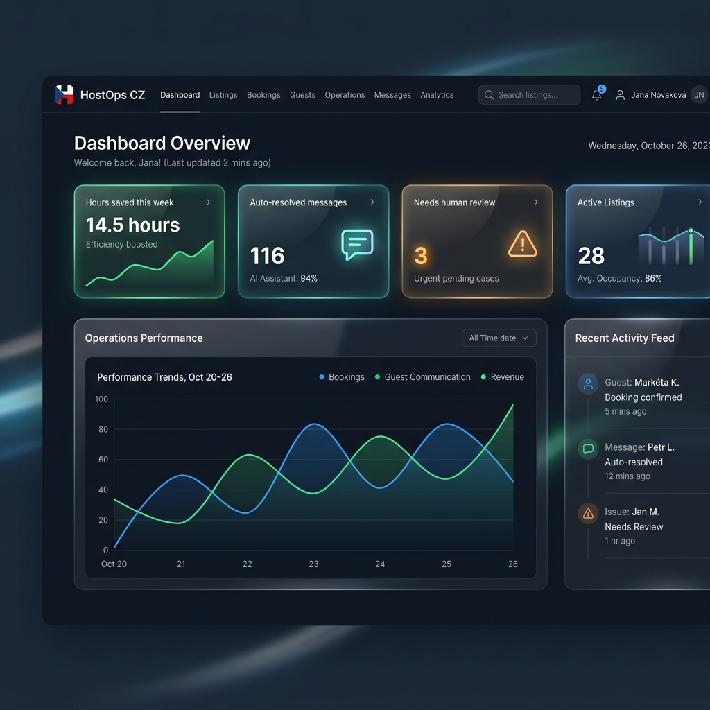
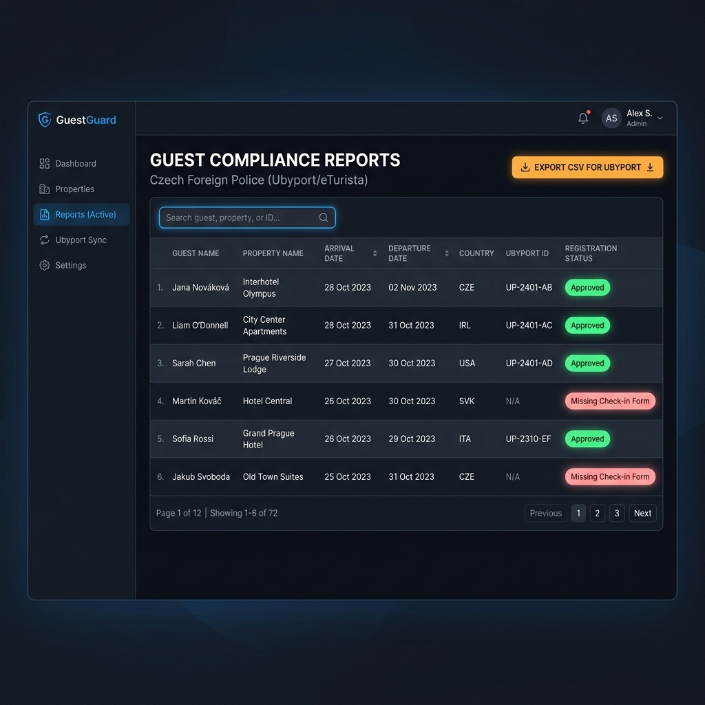
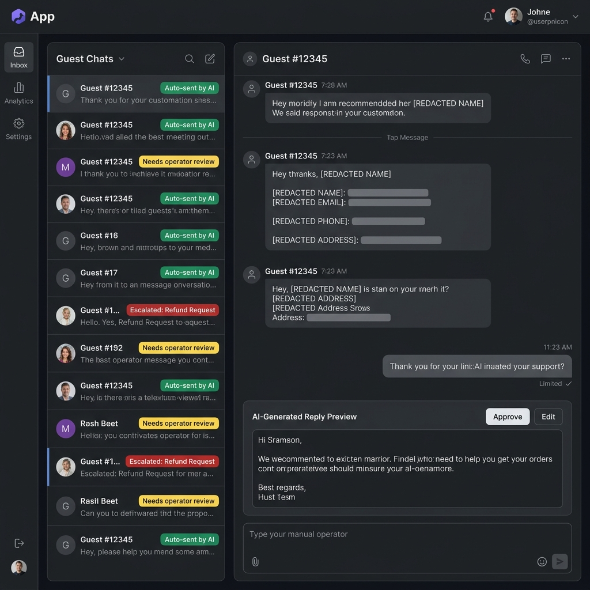

# HostOps CZ

An automated guest operations assistant and Czech Foreign Police compliance portal for short-term rental managers.

## Problem
Prague short-term rental managers managing 5–50 properties spend substantial weekly hours manually addressing repetitive guest questions (such as WiFi, parking, check-in instructions) and completing legally mandated foreign guest registrations with the Czech Foreign Police (via the Ubyport/eTurista portal). In addition, property managers face strict data security challenges: they must comply with GDPR guidelines, avoid exposing sensitive Personally Identifiable Information (PII) to external LLM providers, and ensure that high-risk requests (such as refund claims, complaints, or emergencies) are never auto-replied to by AI.

## Solution
HostOps CZ streamlines rental operations and automates local compliance through:
1. **Source-Grounded AI Conversations**: Ingests guest queries from WhatsApp and Email, triages them automatically against an approved property-specific knowledge base, and drafts or auto-sends replies.
2. **Deterministic Risk & Safety Gating**: Intercepts high-risk messages (refunds, injuries, complaints, emergencies) and routes them to a human operator queue with a safe acknowledgment.
3. **GDPR-Compliant Guest Check-In**: Provides secure, tokenized public check-in forms that encrypt sensitive guest data locally before saving.
4. **Automated Police Registration Exports**: Generates approved, ready-to-upload Ubyport CSV files, keeping data secure and ensuring regulatory compliance.

## My Role
- **Product thinking**: Modeled operational ROI metrics (e.g., "Hours saved this week", "Auto-resolved messages", "Compliance ready") to help property managers track efficiency and legal status.
- **Technical implementation**: Developed the Next.js 16 (App Router) and React 19 dashboard, supporting full page-based views (Overview, Compliance, Messages, Reservations, Properties, and Knowledge) with robust client-side validation.
- **AI/LLM workflow design**: Built a secure multi-stage triage pipeline utilizing keyword overlapping for document retrieval and OpenAI Responses API (`gpt-5.4-mini`) for drafting context-specific answers.
- **Backend/frontend/database work**: Configured the Supabase backend with Row Level Security (RLS) policies for multi-tenant isolation, established HMAC session cookie verification for persistent authentication, and designed background queues for async AI job processing.
- **Coordination between business and technical needs**: Aligned local Czech police reporting regulations (Ubyport) and strict GDPR requirements with automated, low-latency guest messaging operations.

## Key Features
- **Deterministic PII Redaction**: Scrubs dates of birth, email addresses, phone numbers, passport numbers, and visa details from guest messages before communicating with LLM endpoints.
- **Multi-Tenant Console**: Tenant isolation utilizing Supabase Auth and PostgreSQL RLS, separating data, configurations, and logs for different property management teams.
- **AI Triage & Risk Rating**: Automatically flags incoming messages by risk level ("low", "medium", "high") and triggers operator cases for safety or policy anomalies.
- **AES-256-GCM Encryption**: Encrypts sensitive guest passport, birthdate, and nationality data using a dedicated local encryption key before database storage.
- **Official Ubyport CSV Generator**: Standardized, clean exporter that retrieves approved compliance records and structures them for immediate upload to the Czech Foreign Police.
- **Webhook Integration Layer**: Support for Meta WhatsApp Cloud API and Mailgun inbound email webhooks to parse bookings and guest chats asynchronously.

## Tech Stack
- **Frontend**: Next.js 16 (App Router), React 19, Tailwind CSS v4, Lucide React (Icons).
- **Backend**: Next.js API Routes, Caddy / Nginx.
- **Database**: Supabase (PostgreSQL) with Row-Level Security (RLS) policies.
- **AI**: OpenAI Responses API (default model: `gpt-5.4-mini`).
- **Deployment**: Docker Compose, Hetzner Cloud VPS.
- **Integrations**: Meta WhatsApp API, Mailgun.

## Architecture
```
                   [Guest Message (WhatsApp/Email)]
                                  │
                                  ▼
                     [Meta/Mailgun Webhook API]
                                  │
                                  ▼
             [Supabase DB (Messages & AI Job Queue)]
                                  │
                                  ▼
               [AI Process Job (Cron Executed POST)]
                 ├── 1. Redact PII (Regex/Word filter)
                 ├── 2. Evaluate Safety (Escalate if risky)
                 ├── 3. Retrieve/Rank Property Knowledge
                 ├── 4. Call OpenAI (gpt-5.4-mini)
                 └── 5. Auto-send reply OR Escalate Case
```

### Guest Check-In & Compliance Flow
```
[New Reservation Ingested] ──► [Generate Token & Compliance Task]
                                          │
                                          ▼
[Secure Public Link sent to Guest] ──► [Guest Submits Details]
                                          │
                                          ▼
[Local AES-256-GCM Encryption] ──► [Audit Log & Review Dashboard]
                                          │
                                          ▼
[Export CSV for Czech Police (Ubyport)]
```

## Screenshots
Below are mockups illustrating the user interface of the HostOps CZ platform:

#### 1. Operations Overview Dashboard


#### 2. Compliance Records & Ubyport Exports


#### 3. AI Triage & Inbox Risk Gating


## How to Run

### Prerequisites
- Node.js (v20+ recommended)
- Docker & Docker Compose
- Supabase Account / local setup

### Local Development Setup
1. **Clone the repository**:
   ```bash
   git clone https://github.com/Enver0908/herness.git
   cd herness
   ```
2. **Install dependencies**:
   ```bash
   npm install
   ```
3. **Configure environment variables**:
   Create a `.env.local` file by copying the template:
   ```bash
   cp .env.example .env.local
   ```
   Provide the credentials for Supabase, OpenAI, PII Encryption Key, and Cron Secret.

4. **Initialize database schema**:
   Apply migrations to your Supabase instance:
   ```bash
   npx supabase db push
   ```
5. **Run the development server**:
   ```bash
   npm run dev
   ```
   Open [http://localhost:3000](http://localhost:3000) in your browser.

6. **Run tests**:
   ```bash
   npm run test
   ```

### Docker Deployment
Build and run the production environment locally using Docker:
```bash
docker compose up -d --build
```
This starts the Next.js application and wraps it under a Caddy server proxy.

## Security / Privacy
- **Strict PII Protection**: Personally Identifiable Information (PII) like passports, visas, and DOB are never sent to external AI servers.
- **AES-256-GCM Data Encryption**: Identity data submitted during guest check-in is encrypted symmetrically in the application layer before database storage using `PII_ENCRYPTION_KEY`.
- **Tenant Isolation**: Row-Level Security (RLS) policies on Supabase ensure that no organization can read, write, or export guest details of another tenant.
- **GDPR Compliance**: Built around guest consent, strict PII redaction, secure storage, and clear operational logging.
- **No Committed Secrets**: Key values and credentials are parameterized using environment variables and are excluded from version control via `.gitignore`.

## Status
Production pilot / active development. Live preview terminates TLS via Nginx and is deployed on Hetzner VPS under `https://178.104.197.9.sslip.io`.
